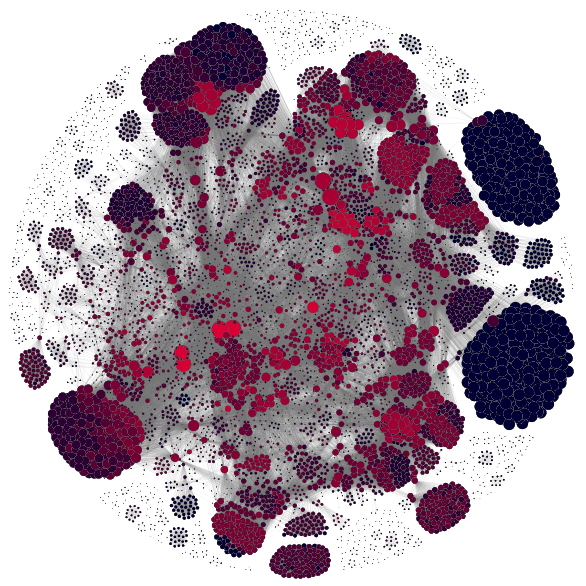

# hypergraph

This library provides additional functions that can be used with the [hypergraph library](https://github.com/PhilChodrow/hypergraph) by Phil Chodrow.

The additional functions are\
Local clustering coefficient for hypergraphs\
Hierarchy coefficient for hypergraphs\
ER-like Random graph model\
Plotting the representing graph of a hypergraph with [Netwulf](https://pypi.org/project/netwulf/)

Furthermore, we provide some of the protein data used in the manuscript.

If used please cite:\
Florian Klimm, Charlotte M Deane, Gesine Reinert, Hypergraphs for predicting essential genes using multiprotein complex data, Journal of Complex Networks, Volume 9, Issue 2, April 2021, cnaa028.
[Journal](https://doi.org/10.1093/comnet/cnaa028) [bioRxiv](https://www.biorxiv.org/content/10.1101/2020.04.03.023937v1)

